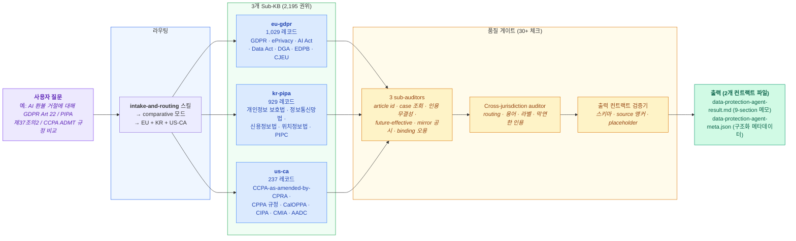
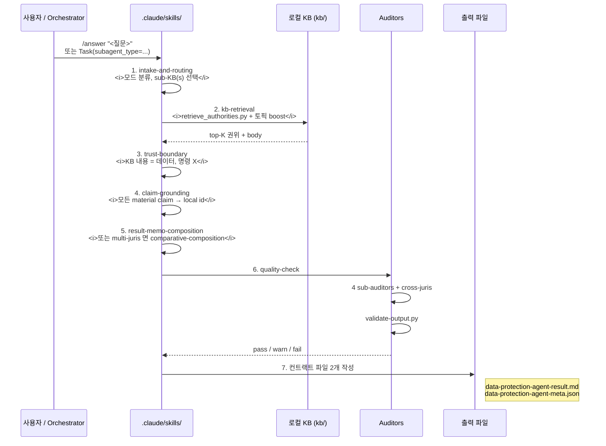
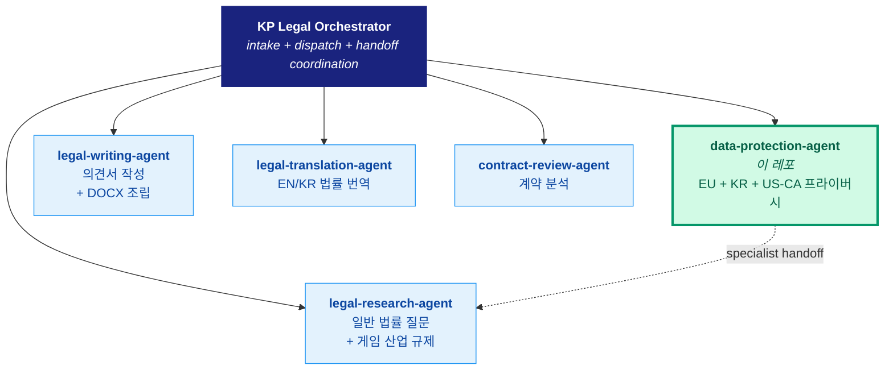

<div align="center">

**[English](README.md)** · **[한국어](README.ko.md)**

> 최신 릴리즈: **[v1.0.0 — 최초 공개 릴리즈](docs/releases/RELEASE-v1.0.0.md)** (영/한 병기)

# Data Protection Agent

### KP Legal Orchestrator · EU·한국·캘리포니아 통합 개인정보 리서치 에이전트

**3개 법역** · **2,195개 권위 인덱싱** · **30+ 인용 감사 체크** · **223개 테스트** · **8단계 리서치 워크플로우**

[Claude Code](https://docs.anthropic.com/en/docs/claude-code/overview) 기반 · 구조화된 RAG · 프로덕션 검증 완료

[](https://claude.ai/code)
[](https://python.org)
[](#지식베이스)
[](#지식베이스)
[](#인용-감사기)
[](#로컬-사전점검--ci)
[](#라이선스)

<br/>

> *"Data structure is intelligence."*
> — 더 똑똑한 검색이 아니라, 더 똑똑한 데이터가 답이다.

</div>

> [!CAUTION]
> **본 도구는 법률 리서치 보조용이며, 법률 자문이 아닙니다.** 출력은 AI가 생성한 결과로, 내장 검증을 거쳤더라도 오류가 있을 수 있습니다. 모든 법적 인용은 사용 전에 반드시 독립적으로 확인해야 합니다. 구체적인 법률 사안에 대한 자문은 자격 있는 변호사에게 받으세요.

> [!TIP]
> **처음 오셨나요?** 슬래시 명령부터 보고 싶으시면 [빠른 시작](#빠른-시작), 이 도구가 무엇을 해결하고 왜 만들어졌는지 알고 싶으시면 [문제 정의](#문제-정의)부터 보세요.

---

## 프로젝트 계보

이 에이전트는 **KP Legal Orchestrator 의 개인정보 리서치 모듈**로, 세 개의 지식베이스를 하나의 cross-jurisdictional 응답 표면으로 통합합니다:

- **EU GDPR 서브-KB** *(이 레포 내 `kb/eu-gdpr/`; v1.0.0 시점에 superseded 된 GDPR-expert sibling 레포에서 흡수)* → GDPR + ePrivacy Directive + EU AI Act + Data Act + Data Governance Act · 1,029개 레코드
- **한국 PIPA 서브-KB** *(이 레포 내 `kb/kr-pipa/`; v1.0.0 시점에 superseded 된 PIPA-expert sibling 레포에서 흡수)* → 개인정보 보호법 (PIPA) + 정보통신망법 + 신용정보법 + 위치정보법 + PIPC 가이드라인 · 929개 레코드
- **California 서브-KB** *(이 레포 내 `sources/us-ca/`; 처음부터 in-tree 빌드)* → CCPA-as-amended-by-CPRA + CPPA 규정 + CIPA + CMIA + AADC + Customer Records Act + 인접 프라이버시 법령 · 237개 레코드

> **v1.0.0 (2026-05-08) 시점부터 모든 KB 컨텐츠는 이 레포의 `kb/` 아래에서 유지됩니다.** GDPR-expert + PIPA-expert sibling 레포는 historical reference 로 보존되지만 superseded 상태이며, 향후 모든 개발 (KB 업데이트 포함) 은 이 레포에서 이루어집니다. README 와 docs 가 자체 완결적이라 sibling 레포를 일일이 열어볼 필요 없습니다.

이 레포가 세 지식베이스 위에 추가하는 레이어:

| 레이어 | 단일 법역 레포에서는 만들 수 없는 이유 |
|---|---|
| **Cross-jurisdiction 라우팅** | 어떤 sub-KB(s) 가 질문에 해당하는지 결정. 단일 법역 레포는 국경을 넘는 라우팅 불가. |
| **Cross-jurisdiction 인용 감사기** | 한 문단 안에 EU/KR/CA 권위가 섞이는 현상, 용어 drift (`controller` vs `business` vs `개인정보처리자`), "법역에 따라 다름" 같은 막연한 표현을 catch. |
| **통합 응답 파이프라인** | 슬래시 명령 하나 (`/answer`) 로 intake → retrieval → grounding → composition → audit → write 8단계를 세 KB 모두에 걸쳐 엄격한 source-anchor 규율로 수행. |
| **출력 컨트랙트 검증기** | 결과 메모(.md) + 메타데이터(.json) 의 머신 검증 가능한 스키마. 모든 key finding 은 `src_NNN` id 로 추적되고, 모든 source id 는 로컬 KB 권위로 resolve 되어야 함. |

---

## 목차

- [프로젝트 계보](#프로젝트-계보)
- [문제 정의](#문제-정의)
- [솔루션](#솔루션)
- [지식베이스](#지식베이스)
- [동작 원리](#동작-원리)
- [빠른 시작](#빠른-시작)
- [출력 컨트랙트](#출력-컨트랙트)
- [Source 신뢰도 모델](#source-신뢰도-모델)
- [인용 감사기](#인용-감사기)
- [레포 구조](#레포-구조)
- [로컬 사전점검 + CI](#로컬-사전점검--ci)
- [로드맵](#로드맵)
- [KP Legal Orchestrator 의 일부로서](#kp-legal-orchestrator-의-일부로서)
- [라이선스](#라이선스)
- [면책사항](#면책사항)

---

## 문제 정의

실무 개인정보 컴플라이언스는 단일 법역으로 끝나는 경우가 드뭅니다. 사용자 데이터를 다루는 SaaS 제품은 **GDPR (EU 사용자)**, **PIPA (한국 사용자)**, **CCPA-as-amended-by-CPRA (캘리포니아 소비자)** 분석을 동시에 요구하는 경우가 일상입니다. EU 전용 회사도 캘리포니아 마케팅 노출이 있고, 한국 전용 회사도 API 를 통해 EU 고객을 받습니다.

기존 AI 프라이버시 도구들이 이 시나리오에서 무너지는 이유:

- **설계상 단일 법역** — 대부분의 도구가 GDPR *또는* PIPA *또는* CCPA 만 다룹니다. 셋 다 다루는 도구는 거의 없고, cross-juris 질문은 수동 오케스트레이션을 강요합니다.
- **권위를 조용히 섞어버림** — 다중 법역으로 강제하면, 일반 RAG 는 GDPR Article 22 와 CCPA opt-out 을 한 문단에 같은 개념인 것처럼 합쳐버립니다. 그러나 이는 같지 않습니다. "Personal data" (GDPR) 와 "personal information" (CCPA, PIPA) 은 호환되는 용어가 아니고, lawful basis (GDPR 제6조) 와 notice-at-collection (CCPA § 1798.100) 은 다른 법적 hook 입니다.
- **인용 규율 상실** — flat PDF 위의 일반 RAG 는 조문 번호를 hallucinate 하고, 판례 holding 을 fabricate 하고, recital 을 binding 으로 잘못 분류하며, 연방법원 판결을 캘리포니아 주 precedent 로 오인합니다.
- **품질 게이트 부재** — 답변이 실제로 primary law 에 grounded 되어 있는지 프로그램적으로 확인할 방법이 없습니다. 사용자가 유일한 방어선입니다.

이게 잘못되면 비용이 큽니다. 규제기관, 원고, 기자들은 GDPR Recital 71 이 binding 으로 인용된 메모, § 1798.150 이 캘리포니아 유출 통지 statute 라고 주장한 메모 (실제로는 private right of action), 9th Circuit 의 CCPA 해석을 바인딩 캘리포니아 precedent 로 취급한 메모를 즉시 잡아냅니다.

---

## 솔루션



data-protection-agent 가 단일 법역 도구로는 불가능한 일을 합니다:

1. **질문별로 라우팅** — `index/jurisdiction-routing.json` 을 사용해 적절한 sub-KB(s) 로. 모드: `ca_only` / `kr_only` / `eu_only` / `multi_jurisdiction` / `comparative` / `fallback_us` / `fallback`.
2. **로컬 KB 에서만 retrieve** (웹 fetch X, training-data fallback X) — `unified-authority-index.json` (2,195 권위) + `unified-topic-index.json` (29개 큐레이션 토픽 매핑) 에 대한 결정론적 키워드 + 토픽 boost 스코어링.
3. **모드별로 composition** — 엄격한 source-anchor 규율. 모든 key finding 은 `src_NNN` id 로 추적, 한 문단에 두 법역 권위가 섞이지 않음. comparative 모드는 side-by-side 매트릭스 + 법역별 라벨 commentary 를 사용.
4. **프로그램적 감사** — 4개 auditor layer (3 sub-auditors + cross-jurisdiction) 에 걸친 30+ regex/구조 체크.
5. **출력 컨트랙트 검증** — markdown 메모와 JSON 메타데이터 둘 다 머신 체크 후 완료 선언. CI 가 컨트랙트 위반 시 fail.
6. **모르는 것을 기록** — 범위 밖 (Virginia CDPA, Brazil LGPD 등) 은 `coverage_gaps` 로 정직하게 flag, fabricate 안 함. 추측보다 loud-fail 을 선택.

결과: 변호사가 규제기관 앞에서 defend 할 수 있는 리서치 산출물.

---

## 지식베이스

3개 sub-KB 를 하나의 runtime tree 로 import. 각 sub-KB 는 풍부한 YAML frontmatter 가 붙은 per-section 마크다운 파일, 빠른 lookup 을 위한 JSON 인덱스, 그리고 (해당하는 경우) cross-reference 그래프를 가집니다.

| Sub-KB | Source-of-truth | 레코드 | 주요 법령 | 권위 유형 |
|:---|:---|---:|:---|:---|
| `eu-gdpr` | in-tree (`kb/eu-gdpr/`) — v1.0.0 시점에 GDPR-expert 에서 흡수 | **1,029** | GDPR | Articles · Recitals · EDPB 문서 (guidelines/opinions/binding decisions) · CJEU 판례 · enforcement decisions |
| `kr-pipa` | in-tree (`kb/kr-pipa/`) — v1.0.0 시점에 PIPA-expert 에서 흡수 | **929** | 개인정보 보호법 | 법조문 · 시행령 조문 · 정보통신망법 · 신용정보법 · 위치정보법 · PIPC 가이드라인 · 법원 판결 |
| `us-ca` | local `sources/us-ca/` (처음부터 in-tree 빌드) | **237** | CCPA-as-amended-by-CPRA | CCPA 본법 · CPPA 규정 (11 CCR § 7000–7300) · CalOPPA · CIPA · CMIA · AADC · Customer Records Act · OAG 가이드 · 법원 판결 |
| **합계** | | **2,195** | | |

### 지식이 어떻게 들어오는가

```mermaid
flowchart LR
    subgraph hist["Historical lineage<br/><i>(superseded sibling 레포, v1.0.0)</i>"]
        direction TB
        G["GDPR-expert<br/><i>EU 입법은 CELLAR API,<br/>EDPB PDF, CJEU 판례 파일</i>"]
        P["PIPA-expert<br/><i>law.go.kr 구조화 데이터,<br/>PIPC 가이드라인 PDF</i>"]
    end

    subgraph local["In-Tree Sources of Truth"]
        direction TB
        KBEU["<b>kb/eu-gdpr/</b><br/><i>library/ + index/<br/>(v1.0.0 에서 흡수)</i>"]
        KBKR["<b>kb/kr-pipa/</b><br/><i>library/ + index/<br/>(v1.0.0 에서 흡수)</i>"]
        SRC["<b>sources/us-ca/</b><br/><i>library/ + index/<br/>+ build_california_kb.py</i>"]
    end

    IM["<b>scripts/import_namespaced_kbs.py</b><br/>(결정론적, idempotent — 통합 인덱스<br/>refresh; sources/us-ca/ → kb/us-ca/ 복사)"]

    subgraph runtime["Runtime / Unified View"]
        direction TB
        KBCA["kb/us-ca/<br/><i>(sources/us-ca/ 에서 생성)</i>"]
        UI["index/<br/><i>jurisdiction-routing,<br/>unified-authority-index,<br/>unified-topic-index,<br/>unified-source-registry</i>"]
        KBCA --> UI
    end

    G -.v1.0.0 에서 흡수.-> KBEU
    P -.v1.0.0 에서 흡수.-> KBKR
    SRC --> IM
    IM --> KBCA
    KBEU --> UI
    KBKR --> UI

    style hist fill:#f3f4f6,stroke:#9ca3af,color:#374151
    style local fill:#f0fdf4,stroke:#16a34a
    style runtime fill:#eff6ff,stroke:#2563eb
    style IM fill:#fef9c3,stroke:#ca8a04,color:#713f12
    style G fill:#e5e7eb,stroke:#6b7280,color:#374151
    style P fill:#e5e7eb,stroke:#6b7280,color:#374151
    style KBEU fill:#d1fae5,stroke:#059669,color:#065f46
    style KBKR fill:#d1fae5,stroke:#059669,color:#065f46
    style SRC fill:#d1fae5,stroke:#059669,color:#065f46
    style KBCA fill:#dbeafe,stroke:#3b82f6,color:#1e40af
    style UI fill:#dbeafe,stroke:#3b82f6,color:#1e40af
```

3개 sub-KB 모두 이 레포의 `kb/<namespace>/` 아래에서 유지됩니다. EU/KR KB 컨텐츠는 v1.0.0 (2026-05-08) 시점에 GDPR-expert + PIPA-expert sibling 레포로부터 흡수되었으며, sibling 레포들은 이제 superseded 상태이지만 원래의 인제스트 파이프라인 (GDPR 의 CELLAR API, PIPA 의 law.go.kr) 은 historical reference 로 그쪽 README 에 그대로 남아 있습니다. California sub-KB 는 `sources/us-ca/` 에서 `scripts/build_california_kb.py` 로 로컬 빌드되어 importer 가 `kb/us-ca/` 로 복사합니다. 어떤 KB 변경 후에도 `scripts/import_namespaced_kbs.py --clean` 으로 통합 `index/` 트리를 regenerate.

`index/` 의 통합 인덱스는 **생성물이며, 절대 수동 편집하지 않습니다**:

| 파일 | 내용 |
|---|---|
| `index/jurisdiction-routing.json` | namespace 별 라우팅 용어 (intake-and-routing 이 사용) |
| `index/unified-authority-index.json` | 2,195개 권위 전체 평면 리스트 (`unified_id`, `namespace`, `jurisdiction`, `source_grade`, `path` 포함) |
| `index/unified-topic-index.json` | 29개 큐레이션 토픽 매핑 (CA 13 + KR 8 + EU 8) |
| `index/unified-source-registry.json` | sub-KB 별 manifest (import 시각 + 레코드 수) |

### 토픽 매핑 (총 29개)

각 sub-KB 는 자주 묻는 프라이버시 질문을 controlling 권위로 매핑하는 토픽 인덱스를 ship 합니다. retriever 는 키워드 스코어링 위에 토픽 boost (+7) 를 적용하므로, "PIPA 동의" 같은 질문이 키워드만 높게 잡힐 `pipa-art1` (목적) 이 아니라 `pipa-art15` + `pipa-art22` 를 우선 surface 합니다.

| 토픽 패밀리 | 커버리지 |
|:---|:---|
| 통지 / 동의 / 처리 근거 | 3법역 (GDPR Art 6/7/8, PIPA 제15·22조, CCPA § 1798.100 + 11 CCR § 7012) |
| 정보주체 권리 | 3법역 (GDPR Arts 15-22, PIPA 제35-37조의2, CCPA § 1798.105/.110/.115) |
| 민감정보 / 특별 카테고리 | 3법역 (GDPR Art 9, PIPA 제23-24조, CCPA § 1798.121) |
| 유출 통지 | 3법역 (GDPR Art 33-34, PIPA 제34조 + 시행령 제39·40조, CCPA § 1798.150 + Civ § 1798.82) |
| 국외 이전 | EU + KR (GDPR Chapter V, PIPA 제28조의8/9) |
| 자동화된 결정 | 3법역 (GDPR Art 22, PIPA 제37조의2, CCPA 11 CCR § 7200-7222 ADMT regime) |
| DPIA / 영향평가 | 3법역 (GDPR Art 35-36, PIPA 제33조, CCPA 11 CCR § 7150-7155) |
| Enforcement / 벌칙 | 3법역 (GDPR Art 83/82/77, PIPA 제64조의2/64/39, CPPA enforcement) |
| 미성년자 / 아동 | CA 가 가장 강함 (CCPA § 1798.120, 11 CCR § 7070-7071, AADC, SOPIPA) |
| CCPA 고유 | Notice at collection · CalOPPA · CIPA tracking · Data Broker Delete Act |

---

## 동작 원리

에이전트는 **8단계 워크플로우**를 실행합니다 — standalone `/answer` 호출이든 orchestrator subagent 디스패치든 동일한 경로:



### 모드

| 모드 | 사용 시점 | 출력 형태 |
|:---|:---|:---|
| `ca_only` | California 만 시그널 (CCPA, CPRA, CPPA, CIPA, CMIA 등) | 단일 법역 메모 |
| `kr_only` | 한국만 (PIPA, 정보통신망법, 신용정보법, PIPC) | 단일 법역 메모 (한국어 가능) |
| `eu_only` | EU 만 (GDPR, EDPB, AI Act, Data Act, ePrivacy) | 단일 법역 메모 |
| `multi_jurisdiction` | 2+ 법역, 명시적 "비교" 의도 X | 법역별 라벨 section |
| `comparative` | 2+ 법역, 비교 의도 (`compare`, `vs`, `비교`, `차이`) | 매트릭스 + 법역별 commentary |
| `fallback_us` | California 외 미국 프라이버시 (Virginia CDPA, Colorado CPA 등) | Coverage-gap 메모 (KB 범위 밖) |
| `fallback` | 도메인 밖 (프라이버시 X) | 보수적 메모 + 명시적 gap |

모드는 intake 시점에 잠깁니다. 워크플로우 중간에 **silently 모드 전환 안 함**. 사용자 질문이 라우팅된 모드와 충돌하면, 에이전트는 `classification_warnings` 에 기록하고 `coverage_gaps` 에 불확실성을 surface — override 안 함.

### 스킬 (10개 모듈러 instruction)

각 스킬은 `disable-model-invocation: true` frontmatter — `CLAUDE.md` 참조를 통해 명시적으로 호출될 때만 LLM 이 로드. 토큰 예산을 타이트하게 유지하고 워크플로우를 규율적으로 만듦.

| 스킬 | 역할 |
|:---|:---|
| [`intake-and-routing`](.claude/skills/intake-and-routing/SKILL.md) | 모드 분류 + 라우팅 블록 emit |
| [`kb-retrieval`](.claude/skills/kb-retrieval/SKILL.md) | 결정론적 로컬 retrieval + source envelope 빌드 |
| [`trust-boundary`](.claude/skills/trust-boundary/SKILL.md) | KB / web / MCP 의 모든 byte 를 데이터로 취급 (instruction X) |
| [`claim-grounding`](.claude/skills/claim-grounding/SKILL.md) | 모든 material claim → 로컬 권위 id + currentness 체크 |
| [`result-memo-composition`](.claude/skills/result-memo-composition/SKILL.md) | source 앵커가 붙은 9-section 표준 메모 작성 |
| [`comparative-composition`](.claude/skills/comparative-composition/SKILL.md) | 다중 법역 라벨 section + side-by-side 매트릭스; 절대 섞지 않음 |
| [`quality-check`](.claude/skills/quality-check/SKILL.md) | 인용 감사기 + 출력 검증기 + source-coverage 게이트 실행 |
| [`citation-auditor`](.claude/skills/citation-auditor/SKILL.md) | `audit-unified.py` 의 슬래시 스킬 wrapper (CC 사용자 직접 호출 가능) |
| [`output-mode-composition`](.claude/skills/output-mode-composition/SKILL.md) *(v21, vendored)* | `output_mode` 별로 `templates/modes/` 의 적절한 템플릿으로 dispatch |
| [`legal-writing-formatter`](.claude/skills/legal-writing-formatter/SKILL.md) *(v21, vendored)* | 언어별 formatter profile 적용 + DOCX 렌더러와 협업 |

---

## 빠른 시작

### Claude Code 안에서

```text
/answer 캘리포니아 법상 사업자가 개인정보 수집 시점 또는 그 이전에 통지를 제공해야 하는 시점은?
```

에이전트가 8단계 워크플로우를 수행하고 다음을 작성:

- `outputs/data-protection-agent/data-protection-agent-result.md` (9-section 메모)
- `outputs/data-protection-agent/data-protection-agent-meta.json` (구조화 메타데이터)

`OUTPUT_DIR=...` 환경변수로 출력 디렉토리 override 가능. 프롬프트에 `mode=...` 를 넣어 리서치 모드 강제 가능 (예: `mode=comparative`).

정식 의견서 형태의 DOCX 결과물 (표지 페이지 + 기밀 분류 banner + 자동 번호 헤딩 + 각주 변환) 이 필요한 경우:

```text
/answer 캘리포니아 법상 사업자가 개인정보 수집 시점 또는 그 이전에 통지를 제공해야 하는 시점은? output_mode=legal_opinion
```

또는 기존 canonical 메모를 DOCX 로 렌더링하려면 `--docx` 플래그. 자세한 내용은 [출력 모드 (v21)](#출력-모드-v21) 섹션 참조.

### CLI 직접 호출 (LLM 없이)

sibling 레포 + 로컬 sources 에서 KB refresh:

```bash
python3 scripts/import_namespaced_kbs.py --clean
```

질문에 대한 top-K 권위 retrieve — 결정론적 스코어링, synthesis X:

```bash
python3 scripts/retrieve_authorities.py "GDPR Art 22 와 PIPA 제37조의2 비교" --top-k 12
```

결정론적 research packet 작성 (LLM composition X; 파이프라인·테스트 용도):

```bash
python3 scripts/run_data_protection_agent.py "<질문>" --output-dir /tmp/out --print-summary
```

draft 답변을 통합 4-layer auditor 로 audit:

```bash
python3 scripts/audit-unified.py outputs/data-protection-agent/data-protection-agent-result.md
```

출력 디렉토리를 v19 컨트랙트로 검증:

```bash
python3 scripts/validate-output.py outputs/data-protection-agent/
```

로컬 golden-set evaluator 실행 (legacy + v19 모드 13개 fixture):

```bash
python3 scripts/evaluate_golden_set.py --output-dir /tmp/golden --clean
```

### 테스트

```bash
PYTHONPATH=. pytest -q tests              # cross-cutting + e2e (123)
cd sources/us-ca && PYTHONPATH=. pytest -q tests   # CA sub-auditor (49)
cd sources/kr-pipa && PYTHONPATH=. pytest -q tests # KR sub-auditor (23)
cd sources/eu-gdpr && PYTHONPATH=. pytest -q tests # EU sub-auditor (28)
```

총 **223개 테스트**, `main` 에서 모두 green.

### 옵션: pre-commit auditor 훅

```bash
git config core.hooksPath .githooks
```

훅이 staged `.md` 파일들을 통합 auditor 에 통과시킴. `error` finding 은 커밋 abort, `warn` 은 inline 출력. 비활성화: `git config --unset core.hooksPath`. 한 번만 skip: `git commit --no-verify`.

---

## 출력 컨트랙트

성공한 모든 실행은 정확히 두 파일을 작성:

```text
$OUTPUT_DIR/data-protection-agent-result.md     # 9-section 메모
$OUTPUT_DIR/data-protection-agent-meta.json     # 구조화 메타데이터
```

### 결과 메모 구조

```markdown
# Data Protection Agent - Result

## Question        # 사용자 질문 verbatim
## Route Context   # 모드, 법역, namespace (메타와 정확히 일치)
## Short Answer    # 1-3문장, 최소 1개 src_NNN 앵커
## Issues          # 이슈별: answer, sources, confidence, limits
## Analysis        # Rule and Authority / Application / Counter-Analysis / Practical Next Step
## Sources         # 권위 markdown 테이블
## Coverage Gaps   # 또는 "None."
## Handoff Notes   # 또는 "None."
```

`comparative` + `multi_jurisdiction` 모드에서는 Issues + Analysis 가 법역별 라벨 section + `## Comparison Matrix` 테이블로 대체 — **한 문단에 절대 섞지 않음**.

### 메타 JSON 스키마 (필수 키)

```json
{
  "meta_version": "1.0",
  "summary": "2-4문장 압축 요약 (~500 토큰 이하).",
  "research_mode": "ca_only | kr_only | eu_only | multi_jurisdiction | comparative | fallback_us | fallback",
  "mode_source": "self_classified | orchestrator",
  "active_profile": "data-protection-agent",
  "orchestrator_route_mode": null,
  "fallback_reason": null,
  "classification_warnings": [],
  "co_running_agents": [],
  "jurisdictions": ["EU", "KR", "US-CA"],
  "namespaces": ["eu-gdpr", "kr-pipa", "us-ca"],
  "domains": ["data_protection"],
  "issue_map": [...],
  "key_findings": [...],
  "sources": [...],
  "claim_checks": [...],
  "comparison_matrix": [...],
  "coverage_gaps": [...],
  "handoff_notes": [],
  "error": null
}
```

### Source envelope

```json
{
  "id": "src_001",
  "authority_id": "us-ca:ca-civ-1798.100",
  "namespace": "us-ca",
  "jurisdiction": "US-CA",
  "title": "General Duties of Businesses that Collect Personal Information",
  "citation": "Cal. Civ. Code § 1798.100",
  "pinpoint": "(a)(1)-(3)",
  "grade": "A",
  "authority_level": "binding",
  "official_url": "https://cppa.ca.gov/pdf/20260101_ccpa_statute.pdf",
  "local_path": "kb/us-ca/library/grade-a/ca-ccpa-statute/civ-1798.100.md",
  "currentness": {
    "status": "current",
    "checked_as_of": "2026-05-08",
    "effective_date": "2026-01-01"
  }
}
```

`scripts/validate-output.py` 가 두 형태 모두 강제. CI 가 컨트랙트 위반에 fail. 검증기는 v19 이전 결정론적 runner 의 출력에 대해 **legacy_packet 모드**도 지원 — 구버전 packet 은 v19-strict 키 만족 불필요하지만, 누락된 v19 키는 warning 으로 surface 해서 사용자가 full 컨트랙트가 아님을 알 수 있게 함.

---

## 출력 모드 (v21)

`research_mode` (어떤 sub-KB 를 조회할지) 와 `output_mode` (어떤 형식으로 산출할지) 는 **직교 (orthogonal) 한 두 축** 입니다. 디폴트 `output_mode` 는 `canonical` — v19 에서 도입한 9-section 리서치 메모. v21 은 client-facing DOCX 산출물용 `legal_opinion` 모드 + `legal-research-agent` 에서 vendor 한 4개 추가 템플릿을 더합니다.

| `output_mode` | 청자 | 형식 | 렌더러 |
|:---|:---|:---|:---|
| `canonical` (디폴트) | 변호사 / 패럴리갈 | Markdown | — |
| `legal_opinion` | 의뢰인 / GC / 사내 법무팀 | Markdown + 자동 DOCX | `scripts/render-legal-opinion-docx.py` |
| `executive_brief` | 의사결정자 / 임원 | Markdown (+ 옵션 DOCX/HTML) | `scripts/render-docx.py` / `scripts/render-html.py` |
| `comparative_matrix` | Cross-juris 비교 reader | Markdown (+ 옵션 DOCX/HTML) | `scripts/render-docx.py` / `scripts/render-html.py` |
| `enforcement_case_law` | 소송 / enforcement 리스크 reader | Markdown (+ 옵션 DOCX/HTML) | `scripts/render-docx.py` / `scripts/render-html.py` |
| `black_letter_commentary` | 학술 / 주석서 reader | Markdown (+ 옵션 DOCX/HTML) | `scripts/render-docx.py` / `scripts/render-html.py` |

모든 output mode 는 **`--html` 플래그**로 HTML 렌더링도 가능 (v22 추가, vendored `scripts/render-html.py`, marko 기반, self-contained 스타일 문서 — browser/email/intranet circulation 용도). DOCX 와 HTML 은 독립적으로 작동, 조합 가능.

`/answer` 한 번 호출로 4개 출력 형태 (`*.md` / `*-meta.json` / `*.docx` / `*.html`) 모두 생성하는 worked example: [`docs/rendering-examples.md`](docs/rendering-examples.md).

`legal_opinion` 렌더러 (`scripts/render-legal-opinion-docx.py`) 는 한국어 디폴트 표지 페이지 컨벤션 (`수신인: 사내 법무팀 귀중`, 기밀 분류 `CONFIDENTIAL — INTERNAL LEGAL REVIEW`, 날짜 `YYYY년 M월 D일`) 과 영문 디폴트를 모두 ship 합니다. 모든 디폴트는 CLI 플래그로 override 가능. 언어별 formatter profile 은 `knowledge/legal-writing/` 에 위치:

- `ko-legal-opinion-profile.md` — 한국어 의견서 typography + 톤
- `en-formatter-profile.md` / `ko-formatter-profile.md` — 일반 formatter profile
- `docx-ready-markdown-profile.md` — DOCX 렌더링 안전한 markdown 컨벤션
- `formatter-index.md` — 어떤 profile 을 언제 쓰는지

렌더러 + 스킬 스택은 family 내에 이미 존재하는 렌더링 인프라 재발명을 피하기 위해 **`legal-research-agent` 에서 verbatim 으로 vendor**. DPA 도메인 패치 (`legal-research-agent-*` 파일명을 `data-protection-agent-*` 로 rewrite, 작성자 디폴트 rewrite) 는 적용하되 렌더링·typography 로직은 unchanged.

### CLI 예시

```bash
# Canonical 리서치 메모 → DOCX (영문, US letter)
python3 scripts/render-docx.py \
  outputs/data-protection-agent/data-protection-agent-result.md \
  outputs/data-protection-agent/data-protection-agent-result.docx \
  --language en --jurisdiction us --overwrite

# 정식 한국어 legal-opinion DOCX (표지 + 기밀 banner + 자동 번호 헤딩)
python3 scripts/render-legal-opinion-docx.py \
  outputs/data-protection-agent/data-protection-agent-result.md \
  outputs/data-protection-agent/data-protection-agent-result.docx \
  --title "AI 자동화 결정 — 3법역 검토" \
  --recipient "사내 법무팀 귀중" \
  --date "$(date +'%Y년 %-m월 %-d일')" \
  --classification "CONFIDENTIAL — INTERNAL LEGAL REVIEW" \
  --author "Data Protection Agent (data-protection-agent)"

# v22 HTML — 브라우저 viewable, self-contained, 외부 의존 없음
python3 scripts/render-html.py \
  outputs/data-protection-agent/data-protection-agent-result.md \
  outputs/data-protection-agent/data-protection-agent-result.html \
  --title "AI 자동화 결정 — 3법역 검토" \
  --lang ko
```

`requirements.txt` 가 `python-docx>=1.1.0` (DOCX) + `marko>=2.0.0` (HTML) 핀.

---

## Source 신뢰도 모델

3개 sub-KB 가 동일한 A/B/C/D 어휘를 공유 (각 sub-KB 의 `config/source-grades.json`):

| Grade | 무엇 | 인용 시점 |
|:---:|:---|:---|
| **A** | 공식 primary 또는 현행 공식 가이드 — statutes, regulations, 공식 기관 결정, 법원 판결 | binding rule 의 단독 근거 |
| **B** | 공식이지만 nonbinding, 설명적, 집행, 또는 secondary authority — 미러 backed primary authority 포함 (예: California Supreme Court 판결의 SCOCAL 미러) — 로컬 raw source 가 공식 PDF 가 아닌 경우 | Grade A 와 cross-verify; 미러 provenance 공시 필수 |
| **C** | 코멘터리 또는 discovery-only — 학술, 실무자 블로그, 뉴스 | 편집적 컨텍스트만; high-confidence 결론의 단독 근거로 절대 X |
| **D** | 제외 — 검증 안 된 요약, 마케팅 페이지 | 법적 명제에 인용 X |

**미러 공시 룰:** Grade B 미러 backed primary authority (예: Stanford SCOCAL 의 California Supreme Court 판결 사본) 인용 시 다음 같은 괄호 disclosure 필수: `(local copy from SCOCAL mirror; official URL: https://courts.ca.gov/...)`. auditor 의 `mirror_cited_without_disclosure` 체크가 강제.

**연방법원 / California precedent 룰:** California 프라이버시 법에 대한 연방법원 (9th Circuit, district court) 해석은 persuasive — California 주 binding precedent 아님. binding 으로 취급 시 auditor 의 `federal_court_as_ca_binding` warn 발생.

**Recital 룰 (EU):** GDPR Recitals 는 interpretive aid, operative provision 아님. Recital 을 binding 의무로 인용 시 `recital_as_binding` warn. Recital 은 Article-level rule 을 보조해야지, 그 자리를 차지하면 안 됨.

**PIPC 가이드라인 룰 (KR):** PIPC 가이드라인은 행정 해석, statute 아님. binding 으로 인용 시 `pipc_guideline_as_binding` warn. 개인정보 보호법 본법 조항이 binding 효력의 근거.

---

## 인용 감사기

4-layer regex + 구조 auditor, ~30개 distinct 오류 패턴 catch. 전체 카탈로그 [`docs/auditors.md`](docs/auditors.md), 실제 I/O 가 있는 7개 worked 예시 [`docs/examples.md`](docs/examples.md).

### 레이어

| 레이어 | 경로 | 주요 체크 |
|:---|:---|:---|
| **CA sub-auditor** | `sources/us-ca/citation_auditor/california_citation.py` | Statute / regulation / case id 누락 · CPRA standalone framing · OAG FAQ as binding · enforcement as judicial precedent · federal court as CA binding · unpublished as controlling · 2026 regulation source required · mirror disclosure · future-effective cited as current · quote integrity |
| **KR sub-auditor** | `sources/kr-pipa/citation_auditor/korea_citation.py` | Article id 누락 · 시행규칙 (정보통신망법) · PIPC 가이드라인 binding 오용 · 외부 한국법 인용 (KB 미커버) · future-effective bilingual triggers (영문 + 한글) · quote integrity |
| **EU sub-auditor** | `sources/eu-gdpr/citation_auditor/europe_citation.py` | Article / Recital / Case id 누락 · ECLI 조회 · EDPB document number 조회 · Recital binding 오용 · EDPB non-binding doc binding 오용 · future-effective · quote integrity |
| **Cross-jurisdiction** | `cross_jurisdiction_auditor/audit.py` | Citation routing (signal 없는 법역 권위 인용) · 용어 drift (`controller` vs `business` vs `개인정보처리자`) · 다중 법역 라벨 누락 · 막연한 법령 인용 |

### 실행

```bash
# 단일 호출 통합 runner (권장) — 4 auditor 한 프로세스에서
python3 scripts/audit-unified.py outputs/data-protection-agent/data-protection-agent-result.md

# 또는 법역별
python3 sources/us-ca/scripts/audit-california-citations.py < answer.md
python3 sources/kr-pipa/scripts/audit-korea-citations.py < answer.md
python3 sources/eu-gdpr/scripts/audit-europe-citations.py < answer.md
python3 scripts/audit-cross-jurisdiction.py < answer.md
```

### Severity 모델

| Severity | 의미 | 액션 |
|:---:|:---|:---|
| `error` | Statute / regulation / case id 미존재; unpublished 가 controlling 으로 인용 | **Block** — 발송 전 fix |
| `warn` | Binding 오용, 용어 mismatch, 막연한 인용, quote-body mismatch, future-effective 가 현재형으로 | `coverage_gaps` 또는 issue limits 에 inline surface |
| `pass` | findings 0 | Ship |

통합 runner 는 `error` 가 하나라도 있으면 exit 1, 그 외 0. 법역별 runner 도 여전히 사용 가능하지만, 통합 runner 가 권장 디폴트.

### 주요 체크

- **Quote integrity (v18, 3 KB)** — 모든 더블쿼트 인용을 추출해서 인용된 권위의 KB body 에 실제 등장하는지 확인. 가장 흔한 LLM hallucination (정확한 citation id + fabricated quote) catch. KR variant 는 substring-only (한글은 whitespace word boundary 없음).
- **Future-effective check (v17, 3 KB)** — `effective_date` 가 미래인 권위가 현재형 ("currently requires") + future-framing ("will require") 없이 인용되면 warn. KR 은 한+영 bilingual trigger (`현재`, `시행 중`, `해야 한다` + 영문).
- **Recital-as-binding (EU)** — GDPR Recitals 는 interpretive aid. Recital 71 을 binding 의무로 인용 시 warn.
- **EDPB-as-binding (EU)** — EDPB Guidelines / Opinions / Recommendations 는 non-binding; Art. 65 Binding Decision 만 binding. Guideline 을 binding 으로 인용 시 warn.
- **Federal-court-as-CA-binding (CA)** — 9th Circuit 의 CCPA 해석은 persuasive, California 주 binding precedent 아님.
- **Mirror disclosure (CA)** — California Supreme Court 판결의 SCOCAL 미러 사본은 미러 provenance 공시 필수.
- **2026-regulation-source-required (CA)** — 2026-effective CCPA 규정 인용 시 공식 CPPA source URL 이 답변 텍스트 (메타데이터 X) 에 있어야 함.
- **용어 drift (cross-juris)** — `controller` 는 GDPR; `business` 는 CCPA; `개인정보처리자` 는 PIPA. EU 용어를 California section 에 쓰면 warn.

### 테스트 커버리지

| 레이어 | 테스트 |
|:---|---:|
| CA sub-auditor | 49 |
| KR sub-auditor | 23 |
| EU sub-auditor | 28 |
| Cross-cutting + e2e (golden-set parametrised) | 123 |
| **합계** | **223** |

---

## 레포 구조

```
data-protection-agent/
├── CLAUDE.md, AGENTS.md       # Agent rules + trust boundary policy
├── README.md, README.ko.md, CHANGELOG.md
│
├── kb/                        # 통합 runtime KB (생성물, 수동 편집 금지)
│   ├── eu-gdpr/               #   ← in-tree (v1.0.0 에서 GDPR-expert 에서 흡수)
│   ├── kr-pipa/               #   ← in-tree (v1.0.0 에서 PIPA-expert 에서 흡수)
│   └── us-ca/                 #   ← 로컬 sources/us-ca/ 에서 importer 가 빌드
│       └── index/{ca,kr,eu}-topic-index.json   # namespace 별 토픽 매핑
│
├── index/                     # 통합 인덱스 (생성물)
│   ├── jurisdiction-routing.json
│   ├── unified-authority-index.json    # 2,195 entries
│   ├── unified-topic-index.json        # 29 topics
│   └── unified-source-registry.json
│
├── sources/{us-ca,kr-pipa,eu-gdpr}/
│   ├── citation_auditor/      # 법역별 regex auditor (~10 checks each)
│   ├── scripts/               # 법역별 CLI + sanitize.py
│   └── tests/
│   (us-ca 는 추가로 library/, index/, config/, build_california_kb.py 보유)
│
├── cross_jurisdiction_auditor/
│   └── audit.py               # 4 checks: routing · vocab · labels · vague refs
│
├── unified_auditor/
│   └── run.py                 # importlib 기반 4 auditor aggregator
│
├── scripts/                   # Top-level CLI
│   ├── import_namespaced_kbs.py
│   ├── retrieve_authorities.py
│   ├── run_data_protection_agent.py
│   ├── evaluate_golden_set.py
│   ├── audit-unified.py
│   ├── audit-cross-jurisdiction.py
│   ├── validate-output.py     # v19 출력 컨트랙트 검증기 (538 lines, stdlib only)
│   ├── coverage-report-{,kr,eu,all}.py
│   ├── who-cites.py, who-is.py, kb-diff.py, validate-kb-schema.py
│
├── tests/                     # Cross-cutting + e2e (123 tests)
│   └── test_e2e_agent_pipeline.py    # v19 golden-fixture parametrised
│
├── templates/                 # v19 결과 메모 + 모드별 변형
│   ├── result.md, meta.example.json
│   └── modes/{single-jurisdiction,multi-jurisdiction,comparative-matrix,fallback}.md
│
├── .claude/
│   ├── agents/data-protection-agent.md      # 에이전트 정의 (CLAUDE.md re-import)
│   ├── commands/answer.md                   # /answer 슬래시 명령
│   └── skills/                              # 8 skills
│
├── config/
│   └── golden-set.json        # 13 fixtures (5 v19 + 8 legacy CA cases)
│
└── docs/
    ├── auditors.md            # 30+ check 전체 카탈로그
    ├── examples.md            # I/O 가 있는 7개 worked auditor 사례
    ├── agent-protocol.md      # Runtime protocol 명세
    ├── kb-operations-guide.md # Build / refresh / verify
    ├── README.md              # docs/ 폴더 레이아웃 가이드
    └── sub-kb-operations/     # sub-KB 별 운영 노트
```

> 라운드별 plan 문서 (v3-v20) 는 `.local/planning/v{N}/` 에 저장되며 v18 이후 git tracked X. `CHANGELOG.md` 가 모든 라운드를 요약.

---

## 로컬 사전점검 + CI

### 로컬 사전점검

push 전에 전체 게이트를 로컬에서 실행:

```bash
# 4개 테스트 게이트 (모두 green 필수)
cd sources/us-ca && PYTHONPATH=. pytest -q tests
cd ../kr-pipa && PYTHONPATH=. pytest -q tests
cd ../eu-gdpr && PYTHONPATH=. pytest -q tests
cd ../.. && PYTHONPATH=. pytest -q tests

# Golden set (13/13)
python3 scripts/evaluate_golden_set.py --output-dir /tmp/golden --clean

# KB schema 검증 (14 indexes, 2,414 items)
python3 scripts/validate-kb-schema.py

# main 대비 KB snapshot diff (의도하지 않은 churn catch)
python3 scripts/kb-diff.py --base main
```

### CI

`.github/workflows/ci.yml` 가 모든 push + PR 에서 11개 분리된 step 으로 실행 — 각 게이트가 PR check log 에서 자체 pass/fail 시그널을 가짐:

1. Python 3.12 setup
2. Requirements install
3. CA KB build + validate
4. KR/EU sibling 레포 graceful skip (CI runner 에 sibling 없을 때)
5. CA sub-auditor 테스트
6. KR sub-auditor 테스트 (sibling 없으면 skip)
7. EU sub-auditor 테스트 (sibling 없으면 skip)
8. Cross-cutting + e2e 테스트
9. Golden set 평가
10. KB schema 검증
11. KB snapshot diff

KR/EU step 은 sibling 레포가 runner 에 없을 때 graceful skip (sibling 레포가 vendor 되기 전 fresh PR CI 의 일반적 상황). CA path 는 항상 실행.

---

## 로드맵

| 상태 | 항목 | 비고 |
|:---:|:---|:---|
| ✅ 완료 (v3-v20) | Sub-KB 통합, 30+ auditor 체크, 에이전트 응답 파이프라인, 29개 토픽 매핑, 13개 golden fixture, 출력 검증기, 223 테스트 | Production-ready |
| ⏳ 검토 중 | LRA 스타일 `output_mode` 축 (executive_brief, compliance_checklist, enforcement_focused) | `research_mode` 축 (법역 라우팅) 은 잠겨있음; `output_mode` 는 별도 직교 축 |
| ⏳ 검토 중 | KR 판례 import | 별도 sub-KB 빌드 필요 (v1.0.0 이전에 EU/KR KB 가 인제스트되던 방식과 유사) |
| ⏳ 검토 중 | MCP 통합 | `korean-law` MCP 로 KR primary-source 라이브 fetch — `legal-research-agent` 에서 이미 사용 중 |
| 🚫 범위 밖 | 다중 주 미국 프라이버시 (Virginia CDPA, Colorado CPA 등) | 각자 dedicated sub-KB 빌드 라운드 필요; 그전까지 `fallback_us` 로 flag |
| 🚫 범위 밖 | LLM provider 통합을 코드로 | 에이전트는 Claude Code 안에서 실행; 슬래시 명령 실행 중 composition 은 LLM 안에 |

---

## KP Legal Orchestrator 의 일부로서

이 레포는 KP Legal Orchestrator 그래프의 **프라이버시 specialist** 입니다:



**Subagent dispatch 컨트랙트.** Orchestrator 에서 호출되면, 에이전트는 `intake_payload` (질문 텍스트, 선택적 사전 분류 모드, 선택적 co-running agent 리스트, 출력 디렉토리) 를 읽고 두 컨트랙트 파일을 제공된 `output_dir` 에 작성. 에이전트는 다른 subagent 를 callback 호출 안 함; specialist handoff 은 메타의 `handoff_notes` 에 기록되어 orchestrator 가 후속 조치.

**Standalone 사용.** `/answer` 직접 호출 시, 에이전트가 self-classify, `$OUTPUT_DIR` env (디폴트 `outputs/data-protection-agent/`) 에서 출력 디렉토리 선택, 동일한 두 컨트랙트 파일 + 한 줄 요약 생성.

[`.claude/agents/data-protection-agent.md`](.claude/agents/data-protection-agent.md) 의 에이전트 정의는 `@`-import 로 `CLAUDE.md` 를 re-import 해서 standalone 과 subagent surface 가 절대 drift 안 하게 함.

---

## 라이선스

Apache 2.0 — [`LICENSE`](LICENSE) 참조.

---

## 면책사항

이 도구는 **법률 리서치 보조 전용**이며, 법률 자문을 제공하지 않고, 변호사-의뢰인 관계를 형성하지 않으며, 자격 있는 법률 자문을 대체할 수 없습니다. 출력은 AI 가 생성한 결과이며, 내장 인용 감사기와 출력 검증기에도 불구하고 오류가 있을 수 있습니다. 본 도구가 생성한 모든 법적 인용은 전문적·규제적·소송 컨텍스트에서 의존하기 전에 **공식 source 를 통해 독립적으로 확인**해야 합니다. 프라이버시 법은 빠르게 진화합니다 — 시행일, 개정, 규제 가이드는 자주 변경됩니다.

구체적인 법률 사안에 직면해 있다면, 해당 법역에서 자격을 갖춘 변호사에게 자문을 받으세요.

---

## 기여

PR 을 열기 전에 [`CLAUDE.md`](CLAUDE.md) (에이전트 룰 + 법역 라우팅) 와 [`AGENTS.md`](AGENTS.md) (trust boundary 정책) 를 읽으세요. CI 가 통과해야 하고, 통합 auditor 가 새로운 example output 에 대해 `pass` (또는 `warn` 만) 를 보고해야 합니다.

라운드별 개발 히스토리는 [`CHANGELOG.md`](CHANGELOG.md) 참조.
