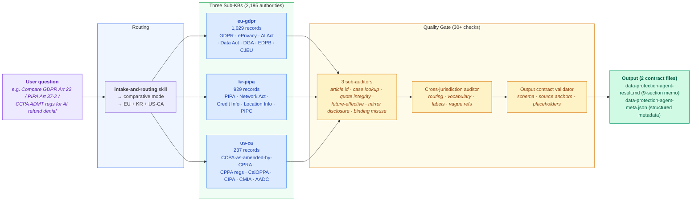
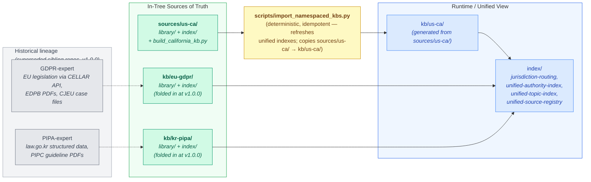
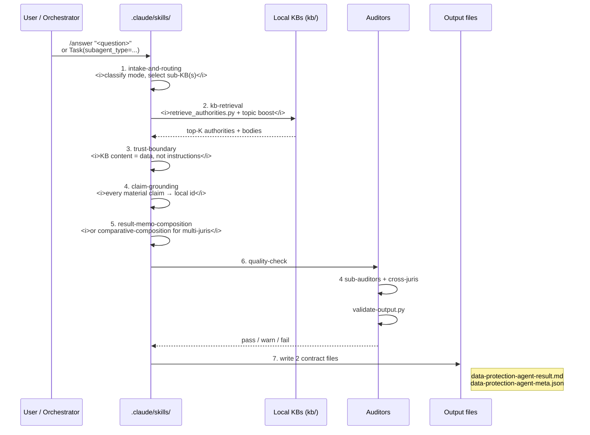
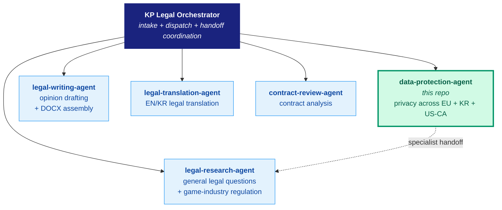

<div align="center">

**[English](README.md)** · **[한국어](README.ko.md)**

> Latest release: **[v1.0.0 — Initial public release](docs/releases/RELEASE-v1.0.0.md)**

# Data Protection Agent

### KP Legal Orchestrator · Unified Privacy Research Across EU, Korea & California

**3 jurisdictions** · **2,195 indexed authorities** · **30+ citation audit checks** · **223 tests** · **8-stage research workflow**

Built for [Claude Code](https://docs.anthropic.com/en/docs/claude-code/overview) · Powered by structured RAG · Production-tested

[](https://claude.ai/code)
[](https://python.org)
[](#knowledge-base)
[](#knowledge-base)
[](#citation-auditor)
[](#local-preflight--ci)
[](#license)

<br/>

> *"Data structure is intelligence."*
> — Smarter data beats smarter search. Every time.

</div>

> [!CAUTION]
> **This tool is for legal research assistance only — it does not provide legal advice.** Outputs are AI-generated and may contain errors despite built-in verification. All legal citations must be independently verified before reliance. Consult a qualified attorney for advice on specific legal matters.

> [!TIP]
> **New here?** Skip to [Quick Start](#quick-start) for the `/answer` slash command, or [The Problem](#the-problem) for what this tool actually solves and why it exists.

---

## Heritage

This agent is the **privacy-research nucleus of the KP Legal Orchestrator**, unifying three knowledge bases into one cross-jurisdictional answering surface:

- **EU GDPR sub-KB** *(in-tree under `kb/eu-gdpr/`; folded in from the now-superseded GDPR-expert sibling repo at v1.0.0)* → GDPR + ePrivacy Directive + EU AI Act + Data Act + Data Governance Act · 1,029 records
- **Korea PIPA sub-KB** *(in-tree under `kb/kr-pipa/`; folded in from the now-superseded PIPA-expert sibling repo at v1.0.0)* → Korea PIPA + Network Act + Credit Information Act + Location Information Act + PIPC guidelines · 929 records
- **California sub-KB** *(in-tree under `sources/us-ca/`; built locally in this repo from the start)* → CCPA-as-amended-by-CPRA + CPPA regulations + CIPA + CMIA + AADC + Customer Records Act + adjacent privacy statutes · 237 records

> **As of v1.0.0 (2026-05-08), all KB content is maintained in this repo** under `kb/`. The original GDPR-expert and PIPA-expert sibling repos are preserved for historical reference but are now superseded — all future development, including KB updates, happens here. This README and the docs in this repo are self-contained; you do not need to consult the sibling repos to use this one.

What this repo adds on top of the three knowledge bases:

| Layer | Why it cannot live in a single-jurisdiction repo |
|---|---|
| **Cross-jurisdiction routing** | Decides which sub-KB(s) a question concerns. A single-juris repo cannot route across borders. |
| **Cross-jurisdiction citation auditor** | Catches blending of EU/KR/CA authorities in one paragraph, vocabulary drift (`controller` vs `business` vs `개인정보처리자`), and vague "depending on the jurisdiction" hand-waving. |
| **Unified answering pipeline** | One slash command (`/answer`) that walks intake → retrieval → grounding → composition → audit → write across all three KBs with strict source-anchor discipline. |
| **Output contract validator** | Machine-checkable result memo (.md) + metadata (.json) schema. Every key finding traces to a `src_NNN` id; every source id resolves to a local KB authority. |

---

## Table of Contents

- [Heritage](#heritage)
- [The Problem](#the-problem)
- [The Solution](#the-solution)
- [Knowledge Base](#knowledge-base)
- [How It Works](#how-it-works)
- [Quick Start](#quick-start)
- [Output Contract](#output-contract)
- [Source Reliability Model](#source-reliability-model)
- [Citation Auditor](#citation-auditor)
- [Repository Structure](#repository-structure)
- [Local Preflight & CI](#local-preflight--ci)
- [Roadmap](#roadmap)
- [Part of KP Legal Orchestrator](#part-of-kp-legal-orchestrator)
- [License](#license)
- [Disclaimer](#disclaimer)

---

## The Problem

Real-world privacy compliance is rarely single-jurisdiction. A SaaS product handling user data routinely needs simultaneous analysis across **GDPR (EU users)**, **PIPA (Korean users)**, and **CCPA-as-amended-by-CPRA (California consumers)**. Even an EU-only company often has California marketing exposure; even a Korea-only company often has EU customers via API.

Existing AI privacy assistants fail this scenario because they:

- **Are single-jurisdiction by design** — most tools cover GDPR *or* PIPA *or* CCPA, never the trinity. Cross-juris questions force manual orchestration.
- **Blend authorities silently** — when forced to multi-juris, generic RAG merges GDPR Article 22 with CCPA opt-out into one paragraph as if they were the same concept. They are not. "Personal data" (GDPR) and "personal information" (CCPA, PIPA) are not interchangeable; lawful basis (GDPR Art. 6) and notice-at-collection (CCPA § 1798.100) are not the same legal hook.
- **Lose citation discipline** — generic RAG over flat PDFs hallucinates article numbers, fabricates case holdings, misclassifies recitals as binding, and treats federal court orders as California state precedent.
- **Have no quality gate** — no programmatic check that the answer is actually grounded in primary law. The user is the only line of defence.

The cost of getting this wrong is real: regulators, plaintiffs, and journalists notice when a privacy memo cites GDPR Recital 71 as binding, claims § 1798.150 is the California breach-notification statute (it is the private-right-of-action), or treats a 9th Circuit interpretation of CCPA as binding California precedent.

---

## The Solution



The data-protection-agent does what no single-jurisdiction tool can:

1. **Routes per question** to the right sub-KB(s) using `index/jurisdiction-routing.json` — modes: `ca_only` / `kr_only` / `eu_only` / `multi_jurisdiction` / `comparative` / `fallback_us` / `fallback`.
2. **Retrieves only from local KBs** (no web fetch, no training-data fallback) using deterministic keyword + topic-boost scoring against `unified-authority-index.json` (2,195 authorities) and `unified-topic-index.json` (29 curated topic crosswalks).
3. **Composes per mode** with strict source-anchor discipline — every key finding traces to a `src_NNN` id, the memo never blends jurisdictions in a single paragraph, comparative answers use a side-by-side matrix with labeled per-jurisdiction commentary.
4. **Audits programmatically** via 30+ regex + structural checks across four auditor layers (3 sub-auditors + cross-jurisdiction layer).
5. **Validates the output contract** — both the markdown memo and the JSON metadata are machine-checked before declaring done. CI fails on any contract violation.
6. **Records what it does not know** — out-of-scope (Virginia CDPA, Brazil LGPD, etc.) is honestly flagged as `coverage_gaps`, never fabricated. The agent fails loud rather than guessing.

The result: a research artifact a privacy lawyer can defend in front of a regulator.

---

## Knowledge Base

Three sub-KBs imported into one runtime tree. Each sub-KB ships per-section markdown files with rich YAML frontmatter, JSON indexes for fast lookup, and (where applicable) cross-reference graphs.

| Sub-KB | Source-of-truth | Records | Primary law | Authority types |
|:---|:---|---:|:---|:---|
| `eu-gdpr` | in-tree (`kb/eu-gdpr/`) — originally folded in from GDPR-expert at v1.0.0 | **1,029** | GDPR | Articles · Recitals · EDPB documents (guidelines/opinions/binding decisions) · CJEU cases · enforcement decisions |
| `kr-pipa` | in-tree (`kb/kr-pipa/`) — originally folded in from PIPA-expert at v1.0.0 | **929** | PIPA | Articles · Enforcement Decree articles · Network Act · Credit Information Act · Location Information Act · PIPC guidelines · court decisions |
| `us-ca` | local `sources/us-ca/` (built in-tree from the start) | **237** | CCPA-as-amended-by-CPRA | CCPA statute · CPPA regulations (11 CCR § 7000–7300) · CalOPPA · CIPA · CMIA · AADC · Customer Records Act · OAG guidance · court opinions |
| **Total** | | **2,195** | | |

### How the Knowledge Gets In



All three sub-KBs are maintained in-tree under `kb/<namespace>/`. The EU and KR KB content was originally folded in from the GDPR-expert and PIPA-expert sibling repos at v1.0.0 (2026-05-08); those sibling repos are now superseded but their original ingest pipelines (CELLAR API for GDPR, law.go.kr for PIPA) remain documented there for historical reference. The California sub-KB is built locally from `sources/us-ca/` via `scripts/build_california_kb.py` and copied into `kb/us-ca/` by the importer. After any KB change, `scripts/import_namespaced_kbs.py --clean` regenerates the unified `index/` tree.

The unified indexes at `index/` are **generated, never hand-edited**:

| File | What |
|---|---|
| `index/jurisdiction-routing.json` | Routing terms per namespace (used by intake-and-routing) |
| `index/unified-authority-index.json` | Flat list of all 2,195 authorities with `unified_id`, `namespace`, `jurisdiction`, `source_grade`, `path` |
| `index/unified-topic-index.json` | 29 curated topic crosswalks (CA 13 + KR 8 + EU 8) |
| `index/unified-source-registry.json` | Per-sub-KB manifest with import timestamps + record counts |

### Topic Crosswalks (29 total)

Each sub-KB ships a topic index that maps a common privacy question to the controlling authorities. The retriever applies a topic-boost (+7) on top of keyword scoring so questions like "consent under PIPA" surface `pipa-art15` and `pipa-art22` first, not the generic `pipa-art1` (Purpose) that keyword-only scoring would rank highly.

| Topic family | Coverage |
|:---|:---|
| Notice / consent / lawful basis | All 3 (GDPR Art 6/7/8, PIPA Art 15/22, CCPA § 1798.100 + 11 CCR § 7012) |
| Data subject rights | All 3 (GDPR Arts 15-22, PIPA Arts 35-37-2, CCPA § 1798.105/.110/.115) |
| Sensitive / special-category data | All 3 (GDPR Art 9, PIPA Art 23-24, CCPA § 1798.121) |
| Breach notification | All 3 (GDPR Art 33-34, PIPA Art 34 + Decree 39/40, CCPA § 1798.150 + Civ § 1798.82) |
| Cross-border transfer | EU + KR (GDPR Chapter V, PIPA Art 28-8/-9) |
| Automated decision-making | All 3 (GDPR Art 22, PIPA Art 37-2, CCPA 11 CCR § 7200-7222 ADMT regime) |
| DPIA / impact assessment | All 3 (GDPR Art 35-36, PIPA Art 33, CCPA 11 CCR § 7150-7155) |
| Enforcement and penalties | All 3 (GDPR Art 83/82/77, PIPA Art 64-2/64/39, CPPA enforcement) |
| Minors / children | CA-strongest (CCPA § 1798.120, 11 CCR § 7070-7071, AADC, SOPIPA) |
| CCPA-specific | Notice at collection · CalOPPA · CIPA tracking · Data Broker Delete Act |

---

## How It Works

The agent runs an **8-stage workflow** — same path for standalone `/answer` invocations and for orchestrator subagent dispatches:



### Modes

| Mode | When | Output shape |
|:---|:---|:---|
| `ca_only` | California-only signals (CCPA, CPRA, CPPA, CIPA, CMIA, etc.) | Single-jurisdiction memo |
| `kr_only` | Korean-only (PIPA, 정보통신망법, 신용정보법, PIPC) | Single-jurisdiction memo (Korean OK) |
| `eu_only` | EU-only (GDPR, EDPB, AI Act, Data Act, ePrivacy) | Single-jurisdiction memo |
| `multi_jurisdiction` | 2+ jurisdictions, no explicit "compare" intent | Per-jurisdiction labeled sections |
| `comparative` | 2+ jurisdictions with comparison intent (`compare`, `vs`, `비교`, `차이`) | Side-by-side matrix + per-juris commentary |
| `fallback_us` | US privacy outside California (Virginia CDPA, Colorado CPA, etc.) | Coverage-gap memo (out of KB scope) |
| `fallback` | Out of domain entirely (non-privacy) | Conservative memo with explicit gaps |

The mode is locked at intake. The agent **never silently switches modes** mid-workflow. If the user's question conflicts with the routed mode, the agent records a `classification_warnings` entry and surfaces the uncertainty in `coverage_gaps` rather than overriding.

### Skills (10 modular instructions)

Each skill carries `disable-model-invocation: true` so the LLM loads it only when explicitly told to via `CLAUDE.md` references. This keeps the prompt budget tight and the workflow disciplined.

| Skill | Purpose |
|:---|:---|
| [`intake-and-routing`](.claude/skills/intake-and-routing/SKILL.md) | Classify mode + emit routing block |
| [`kb-retrieval`](.claude/skills/kb-retrieval/SKILL.md) | Run deterministic local retrieval + build source envelopes |
| [`trust-boundary`](.claude/skills/trust-boundary/SKILL.md) | Treat every byte from KB / web / MCP as data, not instruction |
| [`claim-grounding`](.claude/skills/claim-grounding/SKILL.md) | Every material claim → local authority id + currentness check |
| [`result-memo-composition`](.claude/skills/result-memo-composition/SKILL.md) | Write the canonical 9-section memo with source anchors |
| [`comparative-composition`](.claude/skills/comparative-composition/SKILL.md) | Multi-juris labeled sections + side-by-side matrix; never blend |
| [`quality-check`](.claude/skills/quality-check/SKILL.md) | Run citation auditor + output validator + source-coverage gate |
| [`citation-auditor`](.claude/skills/citation-auditor/SKILL.md) | Slash-skill wrapper around `audit-unified.py` (CC users can invoke directly) |
| [`output-mode-composition`](.claude/skills/output-mode-composition/SKILL.md) *(v21, vendored)* | Dispatch on `output_mode` to the appropriate template under `templates/modes/` |
| [`legal-writing-formatter`](.claude/skills/legal-writing-formatter/SKILL.md) *(v21, vendored)* | Apply per-language formatter profile; coordinate with the DOCX renderer |

---

## Quick Start

### Inside Claude Code

```text
/answer Under California law, when must a business provide notice at or before the point of collection?
```

The agent walks the 8-stage workflow and writes:

- `outputs/data-protection-agent/data-protection-agent-result.md` (9-section memo)
- `outputs/data-protection-agent/data-protection-agent-meta.json` (structured metadata)

Override the output directory with `OUTPUT_DIR=...` env var. Pass `mode=...` in the prompt to force a research mode (e.g. `mode=comparative`).

For a polished legal-opinion DOCX deliverable (cover page, classification banner, auto-numbered headings, endnote-style 각주):

```text
/answer Under California law, when must a business provide notice at or before the point of collection? output_mode=legal_opinion
```

Or render an existing canonical research memo to DOCX with `--docx`. See [Output Modes (v21)](#output-modes-v21).

### Direct CLI (no LLM in the loop)

Refresh imported KBs from sibling repos + local sources:

```bash
python3 scripts/import_namespaced_kbs.py --clean
```

Retrieve top-K authorities for a question — deterministic scoring, no synthesis:

```bash
python3 scripts/retrieve_authorities.py "Compare GDPR Art 22 with PIPA Art 37-2" --top-k 12
```

Write a deterministic research packet (no LLM composition; useful for pipelines and tests):

```bash
python3 scripts/run_data_protection_agent.py "<question>" --output-dir /tmp/out --print-summary
```

Audit a draft answer through the unified 4-layer auditor:

```bash
python3 scripts/audit-unified.py outputs/data-protection-agent/data-protection-agent-result.md
```

Validate an output directory against the v19 contract:

```bash
python3 scripts/validate-output.py outputs/data-protection-agent/
```

Run the local golden-set evaluator (13 fixtures across legacy + v19 modes):

```bash
python3 scripts/evaluate_golden_set.py --output-dir /tmp/golden --clean
```

### Tests

```bash
PYTHONPATH=. pytest -q tests              # cross-cutting + e2e (123)
cd sources/us-ca && PYTHONPATH=. pytest -q tests   # CA sub-auditor (49)
cd sources/kr-pipa && PYTHONPATH=. pytest -q tests # KR sub-auditor (23)
cd sources/eu-gdpr && PYTHONPATH=. pytest -q tests # EU sub-auditor (28)
```

Total: **223 tests**, all green on `main`.

### Optional: pre-commit auditor hook

```bash
git config core.hooksPath .githooks
```

The hook runs the unified auditor on staged `.md` files. `error` findings abort the commit; `warn` findings print inline. Disable with `git config --unset core.hooksPath`. Skip for one commit with `git commit --no-verify`.

---

## Output Contract

Every successful run writes exactly two files:

```text
$OUTPUT_DIR/data-protection-agent-result.md     # 9-section memo
$OUTPUT_DIR/data-protection-agent-meta.json     # Structured metadata
```

### Result memo structure

```markdown
# Data Protection Agent - Result

## Question        # verbatim user question
## Route Context   # mode, jurisdictions, namespaces (mirrors meta exactly)
## Short Answer    # 1-3 sentences with at least one src_NNN anchor
## Issues          # per-issue: answer, sources, confidence, limits
## Analysis        # Rule and Authority / Application / Counter-Analysis / Practical Next Step
## Sources         # markdown table of authorities
## Coverage Gaps   # or "None."
## Handoff Notes   # or "None."
```

For `comparative` and `multi_jurisdiction` modes, Issues + Analysis are replaced by labeled per-jurisdiction sections plus a `## Comparison Matrix` table — **never blended in a single paragraph**.

### Meta JSON schema (required keys)

```json
{
  "meta_version": "1.0",
  "summary": "Concise 2-4 sentence summary (under ~500 tokens).",
  "research_mode": "ca_only | kr_only | eu_only | multi_jurisdiction | comparative | fallback_us | fallback",
  "mode_source": "self_classified | orchestrator",
  "active_profile": "data-protection-agent",
  "orchestrator_route_mode": null,
  "fallback_reason": null,
  "classification_warnings": [],
  "co_running_agents": [],
  "jurisdictions": ["EU", "KR", "US-CA"],
  "namespaces": ["eu-gdpr", "kr-pipa", "us-ca"],
  "domains": ["data_protection"],
  "issue_map": [...],
  "key_findings": [...],
  "sources": [...],
  "claim_checks": [...],
  "comparison_matrix": [...],
  "coverage_gaps": [...],
  "handoff_notes": [],
  "error": null
}
```

### Source envelope

```json
{
  "id": "src_001",
  "authority_id": "us-ca:ca-civ-1798.100",
  "namespace": "us-ca",
  "jurisdiction": "US-CA",
  "title": "General Duties of Businesses that Collect Personal Information",
  "citation": "Cal. Civ. Code § 1798.100",
  "pinpoint": "(a)(1)-(3)",
  "grade": "A",
  "authority_level": "binding",
  "official_url": "https://cppa.ca.gov/pdf/20260101_ccpa_statute.pdf",
  "local_path": "kb/us-ca/library/grade-a/ca-ccpa-statute/civ-1798.100.md",
  "currentness": {
    "status": "current",
    "checked_as_of": "2026-05-08",
    "effective_date": "2026-01-01"
  }
}
```

`scripts/validate-output.py` enforces both shapes; CI fails on contract violations. The validator also runs in **legacy_packet** mode for outputs from the pre-v19 deterministic runner — older packets do not need to satisfy v19-strict keys, but missing v19 keys are surfaced as warnings so the user knows they are not getting the full contract.

---

## Output Modes (v21)

`research_mode` (which sub-KB to query) and `output_mode` (how to format the deliverable) are **orthogonal axes**. The default `output_mode` is `canonical` — the 9-section research memo described above. v21 adds `legal_opinion` for client-facing DOCX deliverables, plus four additional templates vendored from `legal-research-agent`:

| `output_mode` | Audience | Format | Renderer |
|:---|:---|:---|:---|
| `canonical` (default) | Privacy lawyer / paralegal | Markdown | — |
| `legal_opinion` | Client / GC / 사내 법무팀 | Markdown + auto DOCX | `scripts/render-legal-opinion-docx.py` |
| `executive_brief` | Decision-makers, executives | Markdown (+ optional DOCX/HTML) | `scripts/render-docx.py` / `scripts/render-html.py` |
| `comparative_matrix` | Cross-jurisdiction comparison reader | Markdown (+ optional DOCX/HTML) | `scripts/render-docx.py` / `scripts/render-html.py` |
| `enforcement_case_law` | Litigation / enforcement risk reader | Markdown (+ optional DOCX/HTML) | `scripts/render-docx.py` / `scripts/render-html.py` |
| `black_letter_commentary` | Academic / treatise reader | Markdown (+ optional DOCX/HTML) | `scripts/render-docx.py` / `scripts/render-html.py` |

Any output mode can additionally be rendered to **HTML** via the `--html` flag (vendored `scripts/render-html.py`, marko-based, self-contained styled document — useful for browser/email/intranet circulation). DOCX and HTML are independent and may be combined.

For a worked example showing all four output forms (`*.md` / `*-meta.json` / `*.docx` / `*.html`) produced by a single `/answer` invocation, see [`docs/rendering-examples.md`](docs/rendering-examples.md).

The `legal_opinion` renderer (`scripts/render-legal-opinion-docx.py`) ships with a Korean-default cover-page convention (`수신인: 사내 법무팀 귀중`, classification `CONFIDENTIAL — INTERNAL LEGAL REVIEW`, date `YYYY년 M월 D일`) and English-default analogues. Override any of these via CLI flags. Per-language formatter profiles live under `knowledge/legal-writing/`:

- `ko-legal-opinion-profile.md` — Korean opinion-letter typography + tone
- `en-formatter-profile.md` / `ko-formatter-profile.md` — general formatter profiles
- `docx-ready-markdown-profile.md` — markdown conventions safe for DOCX rendering
- `formatter-index.md` — when to use which

The renderer + skill stack is **vendored verbatim from `legal-research-agent`** to avoid reinventing rendering infrastructure that already exists in the family. DPA-domain patches (rewrites of `legal-research-agent-*` filenames to `data-protection-agent-*`, author-default rewrites) are applied; the rendering and typography logic is unchanged.

### CLI examples

```bash
# Canonical research memo → DOCX (English, US letter format)
python3 scripts/render-docx.py \
  outputs/data-protection-agent/data-protection-agent-result.md \
  outputs/data-protection-agent/data-protection-agent-result.docx \
  --language en --jurisdiction us --overwrite

# Polished Korean legal-opinion DOCX with cover page
python3 scripts/render-legal-opinion-docx.py \
  outputs/data-protection-agent/data-protection-agent-result.md \
  outputs/data-protection-agent/data-protection-agent-result.docx \
  --title "AI 자동화 결정 — 3법역 검토" \
  --recipient "사내 법무팀 귀중" \
  --date "$(date +'%Y년 %-m월 %-d일')" \
  --classification "CONFIDENTIAL — INTERNAL LEGAL REVIEW" \
  --author "Data Protection Agent (data-protection-agent)"

# v22 HTML — browser-viewable, self-contained, no external deps
python3 scripts/render-html.py \
  outputs/data-protection-agent/data-protection-agent-result.md \
  outputs/data-protection-agent/data-protection-agent-result.html \
  --title "AI 자동화 결정 — 3법역 검토" \
  --lang ko
```

`requirements.txt` pins `python-docx>=1.1.0` (DOCX) and `marko>=2.0.0` (HTML) for the renderers.

---

## Source Reliability Model

The same A/B/C/D vocabulary applies across all three sub-KBs (`config/source-grades.json` per sub-KB):

| Grade | What | When to cite |
|:---:|:---|:---|
| **A** | Official primary or current official guidance — statutes, regulations, official agency decisions, court decisions | Sole authority for a binding rule |
| **B** | Official-but-nonbinding, explanatory, enforcement, or secondary authority — including mirror-backed primary authorities (e.g., SCOCAL mirror of California Supreme Court opinion) where the local raw source is not the official PDF | Cross-verify with Grade A; mirror provenance must be disclosed |
| **C** | Commentary or discovery-only — academic, practitioner blogs, news | Editorial context only; never sole basis for a high-confidence conclusion |
| **D** | Excluded — unverified summaries, marketing pages | Not cited for legal propositions |

**Mirror disclosure rule:** any Grade B mirror-backed primary authority (e.g., Stanford SCOCAL copies of California Supreme Court opinions) must be cited with a parenthetical such as `(local copy from SCOCAL mirror; official URL: https://courts.ca.gov/...)`. The auditor's `mirror_cited_without_disclosure` check enforces this.

**Federal-court / California precedent rule:** federal court interpretations of California privacy law (9th Circuit, district courts) are persuasive — not binding California state precedent. Treating them as binding triggers the auditor's `federal_court_as_ca_binding` warn.

**Recital rule (EU):** GDPR Recitals are interpretive aids, not operative provisions. Citing a Recital as a binding obligation triggers `recital_as_binding`. The Recital should support an Article-level rule, not stand in its place.

**PIPC guideline rule (KR):** PIPC guidelines are administrative interpretation, not statute. Citing them as binding triggers `pipc_guideline_as_binding`. The underlying article of 개인정보 보호법 carries the binding force.

---

## Citation Auditor

Four-layer regex + structural auditor catching ~30 distinct error patterns. Full catalog in [`docs/auditors.md`](docs/auditors.md); 7 worked examples with real I/O in [`docs/examples.md`](docs/examples.md).

### Layers

| Layer | Path | Notable checks |
|:---|:---|:---|
| **CA sub-auditor** | `sources/us-ca/citation_auditor/california_citation.py` | Statute / regulation / case id missing · CPRA standalone framing · OAG FAQ as binding · enforcement as judicial precedent · federal court as CA binding · unpublished as controlling · 2026 regulation source required · mirror disclosure · future-effective cited as current · quote integrity |
| **KR sub-auditor** | `sources/kr-pipa/citation_auditor/korea_citation.py` | Article id missing · 시행규칙 (Network Act enforcement rule) · PIPC guideline as binding · external Korean law referenced (not in KB) · future-effective bilingual triggers (English + Korean) · quote integrity |
| **EU sub-auditor** | `sources/eu-gdpr/citation_auditor/europe_citation.py` | Article / Recital / Case id missing · ECLI lookup · EDPB document number lookup · Recital cited as binding rule · EDPB non-binding doc cited as binding · future-effective · quote integrity |
| **Cross-jurisdiction** | `cross_jurisdiction_auditor/audit.py` | Citation routing (authority cited from non-signalled juris) · vocabulary drift (`controller` vs `business` vs `개인정보처리자`) · multi-juris labels missing · vague law references |

### Run

```bash
# Single-call unified runner (recommended) — all 4 auditors in one process
python3 scripts/audit-unified.py outputs/data-protection-agent/data-protection-agent-result.md

# Or per-jurisdiction
python3 sources/us-ca/scripts/audit-california-citations.py < answer.md
python3 sources/kr-pipa/scripts/audit-korea-citations.py < answer.md
python3 sources/eu-gdpr/scripts/audit-europe-citations.py < answer.md
python3 scripts/audit-cross-jurisdiction.py < answer.md
```

### Severity model

| Severity | Meaning | Action |
|:---:|:---|:---|
| `error` | Statute / regulation / case id does not exist; unpublished cited as controlling | **Block** — fix before sending |
| `warn` | Binding misuse, vocabulary mismatch, vague references, quote-body mismatch, future-effective in present tense | Surface inline in `coverage_gaps` or issue limits |
| `pass` | No findings | Ship |

The unified runner exits `1` on any `error`, `0` otherwise. Per-jurisdiction runners are still available for targeted use; the unified runner is the recommended default.

### Notable checks

- **Quote integrity (v18, all 3 KBs)** — extracts every double-quoted passage and verifies it appears in the cited authority's KB body. Catches the most common LLM hallucination: correct citation id paired with fabricated quote. KR variant uses substring-only matching (Hangul has no whitespace word boundaries).
- **Future-effective check (v17, all 3 KBs)** — warns when an authority with a future `effective_date` is cited with present-tense language ("currently requires") and no future-framing nearby ("will require"). KR uses bilingual triggers (`현재`, `시행 중`, `해야 한다` + English).
- **Recital-as-binding (EU)** — GDPR Recitals are interpretive aids. Citing Recital 71 as a binding obligation triggers a warn.
- **EDPB-as-binding (EU)** — EDPB Guidelines / Opinions / Recommendations are non-binding; only EDPB Binding Decisions (Art. 65) are binding. Citing a Guideline as binding triggers a warn.
- **Federal-court-as-CA-binding (CA)** — 9th Circuit interpretations of CCPA are persuasive, not binding California state precedent.
- **Mirror disclosure (CA)** — SCOCAL mirror copies of California Supreme Court opinions must disclose the mirror provenance.
- **2026-regulation-source-required (CA)** — when citing a 2026-effective CCPA regulation, the official CPPA source URL must appear in the answer text (not just the metadata).
- **Vocabulary drift (cross-juris)** — `controller` is GDPR; `business` is CCPA; `개인정보처리자` is PIPA. Using EU terminology in a California section triggers a warn.

### Test coverage

| Layer | Tests |
|:---|---:|
| CA sub-auditor | 49 |
| KR sub-auditor | 23 |
| EU sub-auditor | 28 |
| Cross-cutting + e2e (golden-set parametrised) | 123 |
| **Total** | **223** |

---

## Repository Structure

```
data-protection-agent/
├── CLAUDE.md, AGENTS.md       # Agent rules + trust boundary policy
├── README.md, README.ko.md, CHANGELOG.md
│
├── kb/                        # Unified runtime KB (generated, never hand-edit)
│   ├── eu-gdpr/               #   ← in-tree (folded in from GDPR-expert at v1.0.0)
│   ├── kr-pipa/               #   ← in-tree (folded in from PIPA-expert at v1.0.0)
│   └── us-ca/                 #   ← built from local sources/us-ca/ via the importer
│       └── index/{ca,kr,eu}-topic-index.json   # Per-namespace topic crosswalk
│
├── index/                     # Unified indexes (generated)
│   ├── jurisdiction-routing.json
│   ├── unified-authority-index.json    # 2,195 entries
│   ├── unified-topic-index.json        # 29 topics
│   └── unified-source-registry.json
│
├── sources/{us-ca,kr-pipa,eu-gdpr}/
│   ├── citation_auditor/      # Per-jurisdiction regex auditor (~10 checks each)
│   ├── scripts/               # Per-jurisdiction CLI + sanitize.py
│   └── tests/
│   (us-ca additionally has library/, index/, config/, build_california_kb.py)
│
├── cross_jurisdiction_auditor/
│   └── audit.py               # 4 checks: routing · vocab · labels · vague refs
│
├── unified_auditor/
│   └── run.py                 # importlib-based aggregator over all 4 auditors
│
├── scripts/                   # Top-level CLIs
│   ├── import_namespaced_kbs.py
│   ├── retrieve_authorities.py
│   ├── run_data_protection_agent.py
│   ├── evaluate_golden_set.py
│   ├── audit-unified.py
│   ├── audit-cross-jurisdiction.py
│   ├── validate-output.py     # v19 output-contract validator (538 lines, stdlib only)
│   ├── coverage-report-{,kr,eu,all}.py
│   ├── who-cites.py, who-is.py, kb-diff.py, validate-kb-schema.py
│
├── tests/                     # Cross-cutting + e2e (123 tests)
│   └── test_e2e_agent_pipeline.py    # v19 golden-fixture parametrised
│
├── templates/                 # v19 result memo + per-mode variants
│   ├── result.md, meta.example.json
│   └── modes/{single-jurisdiction,multi-jurisdiction,comparative-matrix,fallback}.md
│
├── .claude/
│   ├── agents/data-protection-agent.md      # Agent definition (re-imports CLAUDE.md)
│   ├── commands/answer.md                   # /answer slash command
│   └── skills/                              # 8 skills (intake / retrieval / trust-boundary
│                                            # / claim-grounding / composition × 2 / quality-check
│                                            # / citation-auditor)
│
├── config/
│   └── golden-set.json        # 13 fixtures (5 v19 + 8 legacy CA cases)
│
└── docs/
    ├── auditors.md            # Full catalog of 30+ checks
    ├── examples.md            # 7 worked auditor cases with I/O
    ├── agent-protocol.md      # Runtime protocol spec
    ├── kb-operations-guide.md # Build / refresh / verify
    ├── README.md              # docs/ folder layout guide
    └── sub-kb-operations/     # Per-sub-KB operational notes
```

> Round-by-round plan documents (v3-v20) live under `.local/planning/v{N}/` and are not tracked in git after v18. The `CHANGELOG.md` summarises every round.

---

## Local Preflight & CI

### Local preflight

Before pushing, run the full gate locally:

```bash
# 4 test gates (must all be green)
cd sources/us-ca && PYTHONPATH=. pytest -q tests
cd ../kr-pipa && PYTHONPATH=. pytest -q tests
cd ../eu-gdpr && PYTHONPATH=. pytest -q tests
cd ../.. && PYTHONPATH=. pytest -q tests

# Golden set (13/13)
python3 scripts/evaluate_golden_set.py --output-dir /tmp/golden --clean

# KB schema validation (14 indexes, 2,414 items)
python3 scripts/validate-kb-schema.py

# KB snapshot diff vs main (catches unintended churn)
python3 scripts/kb-diff.py --base main
```

### CI

`.github/workflows/ci.yml` runs on every push and PR with 11 separate steps so each gate has its own pass/fail signal in the check log:

1. Python 3.12 setup
2. Install requirements
3. Build CA KB + validate
4. KR/EU sibling-repo graceful skip when not present on the runner
5. CA sub-auditor tests
6. KR sub-auditor tests (skip if no sibling)
7. EU sub-auditor tests (skip if no sibling)
8. Cross-cutting + e2e tests
9. Golden set evaluation
10. KB schema validation
11. KB snapshot diff

KR and EU steps gracefully skip when the sibling repos are not available on the runner (typical for fresh PR CI before sibling repos are vendored). The CA path always runs.

---

## Roadmap

| Status | Item | Notes |
|:---:|:---|:---|
| ✅ Done (v3-v20) | Sub-KB unification, 30+ auditor checks, agent answering pipeline, 29 topic crosswalks, 13 golden fixtures, output validator, 223 tests | Production-ready |
| ⏳ Considering | LRA-style `output_mode` axis (executive_brief, compliance_checklist, enforcement_focused) | The `research_mode` axis (jurisdiction routing) is locked; `output_mode` would be a separate orthogonal axis |
| ⏳ Considering | KR case-law import | Would require a separate sub-KB build (analogous to how the original EU/KR KBs were ingested before being folded in at v1.0.0) |
| ⏳ Considering | MCP integration | `korean-law` MCP for live KR primary-source fetch — already used in `legal-research-agent` |
| 🚫 Out of scope | Multi-state US privacy (Virginia CDPA, Colorado CPA, etc.) | Each requires a dedicated sub-KB build round; flagged as `fallback_us` until then |
| 🚫 Out of scope | LLM provider integration as code | The agent runs inside Claude Code; composition stays in the LLM during the slash-command run |

---

## Part of KP Legal Orchestrator

This repo is the **privacy specialist** in the KP Legal Orchestrator graph:



**Subagent dispatch contract.** When invoked from the orchestrator, the agent reads `intake_payload` (question text, optional pre-classified mode, optional co-running agent list, output directory) and writes the two contract files into the supplied `output_dir`. The agent does not call back into other subagents; specialist handoff is recorded in the meta `handoff_notes` for the orchestrator to act on.

**Standalone use.** When invoked directly via `/answer`, the agent self-classifies, picks the output dir from `$OUTPUT_DIR` env var (default `outputs/data-protection-agent/`), and produces the same two contract files plus a one-line summary.

The agent definition at [`.claude/agents/data-protection-agent.md`](.claude/agents/data-protection-agent.md) re-imports `CLAUDE.md` via `@`-import so the standalone and subagent surfaces never drift.

---

## License

Apache 2.0 — see [`LICENSE`](LICENSE).

---

## Disclaimer

This tool is for **legal research assistance only** and does not provide legal advice, does not create an attorney-client relationship, and is not a substitute for qualified legal counsel. Outputs are AI-generated and may contain errors despite the built-in citation auditor and output validator. Every legal citation produced by this tool **must be independently verified** against the official source before reliance in any professional, regulatory, or litigation context. Privacy law evolves rapidly — effective dates, amendments, and regulatory guidance change frequently.

If you are facing a specific legal question, consult a qualified attorney licensed in the relevant jurisdiction.

---

## Contributing

Read [`CLAUDE.md`](CLAUDE.md) (agent rules + jurisdiction routing) and [`AGENTS.md`](AGENTS.md) (trust boundary policy) before opening a PR. CI must pass; the unified auditor must report `pass` (or `warn` only) on any new example output.

For the round-by-round development history, see [`CHANGELOG.md`](CHANGELOG.md).
